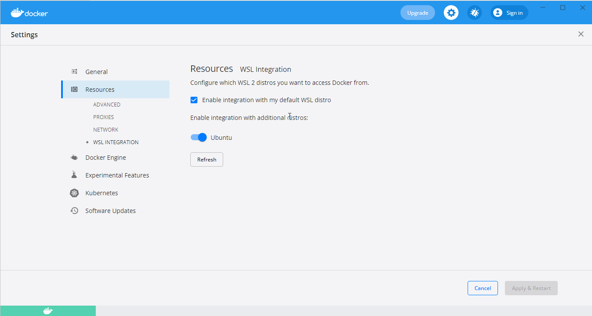
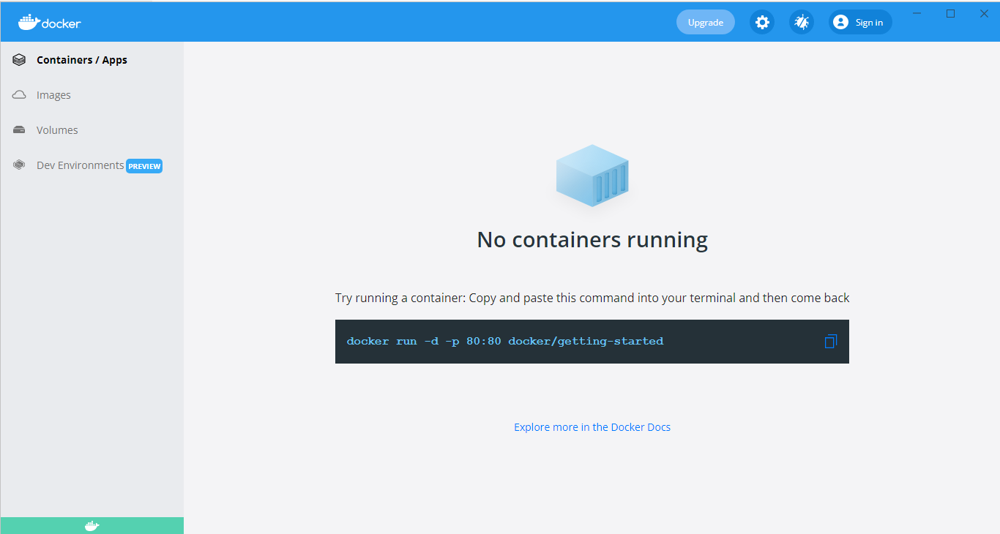
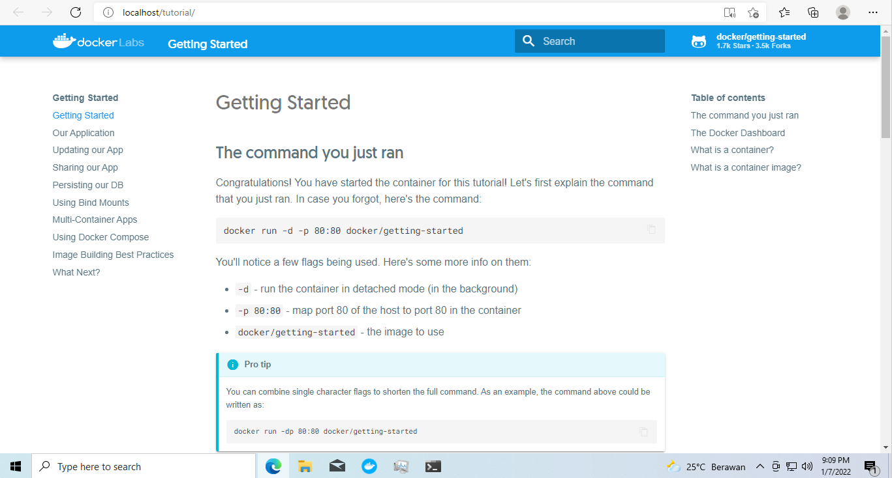

# Day #1: Docker 101

## Setup Preparation

### Setup Visual Studio Code

Untuk mempermudah sesi kali ini, silahkan install Visual Studio Code di laptop kalian https://code.visualstudio.com/ apabila belum terinstall.

### Setup WSL 2

Harapannya kalian sudah memiliki / menginstall wsl 2 di laptop masing-masing. Namun apabila belum bisa mengikuti beberapa step dibawah ini. Kalian bisa skip tahap ini jika wsl 2 sudah terinstall. Cara memeriksanya bisa dengan cara:

1. Buka command prompt / power shell
2. Masukkan perintah:
    ```powershell
    wsl -l -v
    ```
3. Apabila output dari perintah tersebut seperti dibawah ini, maka laptop kalian sudah terinstall wsl 2
    ```powershell
    PS C:\Users\Imam> wsl -l -v
      NAME                   STATE           VERSION
    * Ubuntu                 Stopped         2
    PS C:\Users\Imam>
   ```

Apabila belum terinstall, silahkan ikuti tutorial pada artitkel berikut https://docs.microsoft.com/en-us/windows/wsl/install#install. Setelah melakukan install wsl2, jangan lupa untuk restart laptop kalian. Good Luck!.


### Setup Docker Desktop

1. Download installer [Docker Desktop](https://desktop.docker.com/win/main/amd64/Docker%20Desktop%20Installer.exe)
2. Install dengan manjalankan file `.exe` hasil download dari link sebelumnya
3. Ikuti perintah yang tertera pada installer hingga selesai
4. Setelah instalasi selesai, biasanya kalian diminta untuk melakukan `logout` dari windows, lakukan logout dan masuk kembali ke windows
5. Setelah masuk ke windows, jalankan Docker Desktop (dari desktop / start menu)
6. Di awal setelah install, biasanya ini akan ada loading yang tidak sebentar, tunggu saja.
7. Setelah window Docker terbuka, pilih `Settings > General`

8. Centang checkbox `Use WSL 2 based engine`
9. Pilih Tab `Resources` pada sebelah kiri menu, dan pilih menu `WSL Integration` centang `Enable integration with my default WSL distro`, dan toggle-on distron WSL 2 kalian

10. Clik `Apply & Restart`
11. Kembali ke menu utama dengan klik tombol cancel pada kanan bawah menu
12. Pastikan kalian kembali ke menu / tampilan utama Docker Desktop


Pada tahap ini, Docker Desktop seharusnya sudah terinstall di laptop kalian. Untuk memastikan lebih lanjut, kita akan mencoba menjalankan sebuah container dengan docker command yang tertera pada menu utama.

```bash
docker run -d -p 80:80 docker/getting-started
````

Jalankan perintah tersebut pada **command prompt WSL 2** kalian, kalian bisa masuk ke prompt WSL 2 dengan cara:
1. Buka powershell
2. Jalankan perintah:
    ```powershell
    wsl ~
    ```
3. Jalankan perintah docker untuk menjalankan docker container:
    ```bash
    docker run -d -p 80:80 docker/getting-started
    ```
4. Kurang lebih akan ada output seperti dibawah ini pada console kalian:
    ```bash
    imamfzn@DESKTOP-PB3CQQ3:~$ docker run -d -p 80:80 docker/getting-started
    Unable to find image 'docker/getting-started:latest' locally
    latest: Pulling from docker/getting-started
    97518928ae5f: Pull complete
    a4e156412037: Pull complete
    e0bae2ade5ec: Pull complete
    3f3577460f48: Pull complete
    e362c27513c3: Pull complete
    a2402c2da473: Pull complete
    eb65930377cd: Pull complete
    69465e074227: Pull complete
    Digest: sha256:86093b75a06bf74e3d2125edb77689c8eecf8ed0cb3946573a24a6f71e88cf80
    Status: Downloaded newer image for docker/getting-started:latest
    e83e2cd26a75df3777a21aed8b793bd0d315c52d710e27939496bbf397c006e8
    ````
5. Buka browser kalian, coba akses `http://localhost` dan seharusnya akan muncul halaman `Getting Stated Docker` seperti gambar dibawah ini


Selamat, kalian sudah berhasil menginstall docker pada laptop kalian :tada:

## Introduction
...

### Server, Virtual Machine, Container
...

### Docker
...


## Docker Components
...


### Docker Registry
...

### Docker Image
...


### Docker Container
...

### Docker Volume
...

### Docker Network
...


