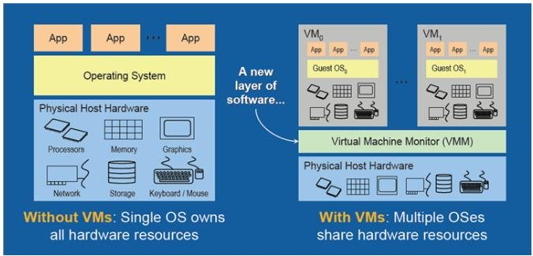

# Day #1: Docker 101

## Setup Preparation

### Setup Visual Studio Code

Untuk mempermudah sesi kali ini, silahkan install Visual Studio Code di laptop kalian https://code.visualstudio.com/ apabila belum terinstall.

### Setup WSL 2

Harapannya kalian sudah memiliki / menginstall wsl 2 di laptop masing-masing. Namun apabila belum bisa mengikuti beberapa step dibawah ini. Kalian bisa skip tahap ini jika wsl 2 sudah terinstall. Cara memeriksanya bisa dengan cara:

1. Buka command prompt / power shell
2. Masukkan perintah:
    ```powershell
    wsl -l -v
    ```
3. Apabila output dari perintah tersebut seperti dibawah ini, maka laptop kalian sudah terinstall wsl 2
    ```powershell
    PS C:\Users\Imam> wsl -l -v
      NAME                   STATE           VERSION
    * Ubuntu                 Stopped         2
    PS C:\Users\Imam>
   ```

Apabila belum terinstall, silahkan ikuti tutorial pada artitkel berikut https://docs.microsoft.com/en-us/windows/wsl/install#install. Setelah melakukan install wsl2, jangan lupa untuk restart laptop kalian. Good Luck!.


### Setup Docker Desktop

1. Download installer [Docker Desktop](https://desktop.docker.com/win/main/amd64/Docker%20Desktop%20Installer.exe)
2. Install dengan manjalankan file `.exe` hasil download dari link sebelumnya
3. Ikuti perintah yang tertera pada installer hingga selesai
4. Setelah instalasi selesai, biasanya kalian diminta untuk melakukan `logout` dari windows, lakukan logout dan masuk kembali ke windows
5. Setelah masuk ke windows, jalankan Docker Desktop (dari desktop / start menu)
6. Di awal setelah install, biasanya ini akan ada loading yang tidak sebentar, tunggu saja.
7. Setelah window Docker terbuka, pilih `Settings > General`

8. Centang checkbox `Use WSL 2 based engine`
9. Pilih Tab `Resources` pada sebelah kiri menu, dan pilih menu `WSL Integration` centang `Enable integration with my default WSL distro`, dan toggle-on distron WSL 2 kalian

10. Clik `Apply & Restart`
11. Kembali ke menu utama dengan klik tombol cancel pada kanan bawah menu
12. Pastikan kalian kembali ke menu / tampilan utama Docker Desktop


Pada tahap ini, Docker Desktop seharusnya sudah terinstall di laptop kalian. Untuk memastikan lebih lanjut, kita akan mencoba menjalankan sebuah container dengan docker command yang tertera pada menu utama.

```bash
docker run -d -p 80:80 docker/getting-started
````

Jalankan perintah tersebut pada **command prompt WSL 2** kalian, kalian bisa masuk ke prompt WSL 2 dengan cara:
1. Buka powershell
2. Jalankan perintah:
    ```powershell
    wsl ~
    ```
3. Jalankan perintah docker untuk menjalankan docker container:
    ```bash
    docker run -d -p 80:80 docker/getting-started
    ```
4. Kurang lebih akan ada output seperti dibawah ini pada console kalian:
    ```bash
    imamfzn@DESKTOP-PB3CQQ3:~$ docker run -d -p 80:80 docker/getting-started
    Unable to find image 'docker/getting-started:latest' locally
    latest: Pulling from docker/getting-started
    97518928ae5f: Pull complete
    a4e156412037: Pull complete
    e0bae2ade5ec: Pull complete
    3f3577460f48: Pull complete
    e362c27513c3: Pull complete
    a2402c2da473: Pull complete
    eb65930377cd: Pull complete
    69465e074227: Pull complete
    Digest: sha256:86093b75a06bf74e3d2125edb77689c8eecf8ed0cb3946573a24a6f71e88cf80
    Status: Downloaded newer image for docker/getting-started:latest
    e83e2cd26a75df3777a21aed8b793bd0d315c52d710e27939496bbf397c006e8
    ````
5. Buka browser kalian, coba akses `http://localhost` dan seharusnya akan muncul halaman `Getting Stated Docker` seperti gambar dibawah ini


Selamat, kalian sudah berhasil menginstall docker pada laptop kalian :tada:

## Introduction

### Virtual Machine & Container

Dengan adaya teknologi virtualisasi machine, kita dapat membagi resource suatu physical machine / dedicated server menjadi beberapa resource machine yang disebut dengan virtual machine (vm). Misal kita memiliki suatu physical machine / dedicated server / bahkan komputer yang kita pakai dengan spesifikasi: RAM 32GB: CPU: 8Core, HDD: 500GB. Dengan spesifikasi tersebut, kita bisa membuat beberapa virtual machine yang berjalan diatas mesin asli tersebut (biasa disebut dengan `host machine`). Misalnya menjadi:

```bash
VM1: Windows 10, RAM 8GB, CPU 2Core, HDD 100GB
VM2: Ubuntu 16, RAM 8GB, CPU 4CORE, HDD 300GB
VM3: Debian 9, RAM 4GB, CPU 2 Core, HDD 100GB
````



Virtual machine tersebut juga dapat dengan mudah & dinamis diubah spesifikasinya sesuai ketersediaan resource pada host machine dan kebutuhan. Selama ini, biasanya `Server` yang kita bayar untuk menginstall aplikasi kita dari provider infrastruktur seperti Amazon, Google Cloud, Digital Ocean sebenarnya adalah dalam bentuk virtual machine. Contohnya layanan [Amazon EC 2 Instance](https://aws.amazon.com/ec2/instance-types/) yang mungkin teman-teman juga pernah menggunakan nya.

Jadi dengan adanya virtual machine:
- Lebih murah dibanding membeli dedicated server / physical machine secara langsung
- Pengelolaan hardware sudah di-abstraksi

Lalu misalnya kita memiliki banyak aplikasi yang harus berjalan di suatu server. Tetapi, masing-masing dari aplikasi tersebut memiliki dependensi yang berbeda-beda. Misalnya:

```bash
app-a: harus berjalan pada sistem operasi linux debian
app-b: harus berjalan pada sistem operasi windows
app-c: harus berjalan pada sistem operasi linux debian pada versi x
app-d: harus berjalan pada sistem operasi linux centos pada versi y
````

Kasus lainnya bisa jadi setiap aplikasi memiliki dependensi sistem operasi yang sama, namun dependensi interpreter aplikasi nya berbeda, misal:

```bash
app-a: harus menggunakan nodejs versi 12
app-b: harus menggunakan nodejs versi 14
app-c: harus menggunakan nodejs versi 10
```

Kasus lainnya lagi, ternyata kebutuhan interpreter dari aplikasi-aplikasi kita tidak berbeda satu sama lain. Contohnya semua aplikasi yang kita miliki sama-sama menggunakan versi nodejs yang sama. Namun karena suatu kepentingan ada hal yang ingin dicapai, misal:

```bash
app-a: tidak boleh ada aplikasi yang bisa mengakses port / disk app-a
app-b: hanya app-a yang boleh mengakses port app-b
app-c: hanya app-b yang boleh mengakses disk app-b
```

Dengan adanya kasus tersebut tentu kita tidak bisa menginstall aplikasi-aplikasi kita di dalam 1 sistem operasi begitu saja baik itu pada 1 dedicated server / 1 virtual machine. Kasus ini biasa dinamakan dengan **Application Isolation**. Bagaimana jika kita ingin melakukan isolasi beberapa aplikasi yang kita miliki dengan vm ? Mudahnya kita bisa melakukan nya dengan membuat model 1 vm 1 aplikasi. Namun dengan model ini, tentunya cost menjadi beberapa kali lipat karena kita perlu membeli / membayar vm tambahan untuk masing-masing aplikasi kita. Lalu kita perlu ada effort untuk melakukan setup / instalasi vm dari awal lagi. Oleh karena itu, muncullah konsep bernama **Container**.


Container digunakan untuk melakukan isolasi aplikasi yang berjalan pada suatu sistem operasi. Dengan adanya container, kita tidak perlu melakukan setup virtual machine seperti instalasi os dari awal. Container lebih murah, dan waktu startup nya lebih cepat dibanding vm. Salah satu teknologi container yang saat ini ramai digunakan adalah **Docker**.


### Docker

Docker merupakan salah satu teknologi container. Dengan adanya docker:

* Aplikasi kita bisa dijalankan di komputer dan environment manapun
* Delivery aplikasi menjadi lebih cepat
* Dapat dengan mudah melakukan scaling aplikasi

Selebihnya tentang docker, bisa dibaca pada halaman overview docker di https://docs.docker.com/get-started/overview/,


## Docker Architecture & Components


### Docker Registry

Container registry merupakan tempat penyimpanan / repository dari `Docker Image`. Registry ini mirip dengan [Github](https://github.com/) sebagai repository code aplikasi kita, namun ini digunakan untuk menyimpan `Docker Image`. Docker menyediakan registry secara online yang disebut dengan [Docker Hub](https://hub.docker.com/). Selain docker hub, ada juga registry yang disediakan oleh beberapa provide misalnya:

* [Amazon Elastic Container Registry](https://aws.amazon.com/ecr/)
* [Google Cloud Container Registry](https://cloud.google.com/container-registry)
* [Digital Ocean Container Registry](https://www.digitalocean.com/products/container-registry/)

Beberapa registry tersebut sifatnya berbayar, sedangkan Docker Hub gratis.


### Docker Image

Docker image merupakan blueprint / installer dari aplikasi yang kita miliki. Docker image berisi dependensi dan perintah untuk menjalankan aplikasi kita. Cara melihat daftar docker image yang kita miliki pada local kita bisa menggunakan command `docker images`. Contoh:

```bash
$ docker images
REPOSITORY                                         TAG                   IMAGE ID       CREATED         SIZE
alpine                                             latest                c059bfaa849c   6 weeks ago     5.59MB
mysql                                              5.7                   87eca374c0ed   8 months ago    447MB
circleci/mysql                                     5.5                   82c04619408a   2 years ago     205MB
ubuntu                                             latest                d13c942271d6   2 days ago      72.8MB
ubuntu                                             18.04                 886eca19e611   2 days ago      63.1MB
mongo                                              4.4.3                 ca8e14b1fda6   11 months ago   493MB
bitnami/mongodb                                    4.4.3-debian-10-r0    e627d98da836   12 months ago   497MB

```

Cara mendownload image dari docker hub bisa menggunakan command `docker pull <image_name>`, Contoh:

```bash
$ docker pull ubuntu
```

Perintah tersebut akan mendownload image ubuntu dari hub.docker.com ke local machine kita. Karena kita hanya menulis nama image nya saja (`ubuntu`) maka docker akan mengambil versi paling terbaru (`latest`) yang ada pada docker hub. Kita bisa mendownload image ubuntu dengan versi yang spesifik, contoh:

```bash
$ docker pull ubuntu:18.04
```

Perintah tersebut akan mendownload image ubuntu dengan versi 18.04. Versi ini dikenal dengan istilah `tag` pada docker image.

Secara umum terdapat 2 jenis image pada docker:

- **Base Images**, image yang tidak memiliki `parent` image, biasanya image dari suatu sistem operasi seperti `ubuntu`, `debian`, `alpine`
- **Child Images**, image / custom image yang dibuat dari `base image` yang sudah ditambahkan beberapa fungsional

Dari segi sumber / pembuatnya bisa dibedakan menjadi:

- **Official Images**, image yang dibuat dan dikelola oleh orang-orang `Docker` secara langsung. Pada contoh diatas `mysql`, `ubuntu`, `mongo` adalah official image.
- **User Images**, image yang dibuat oleh user seperti kita, komunitas, atau perusahaan lain. Biasanya memiliki format `user/image-name`. Pada contoh diatas image yang dibuat oleh user / komunitas adalah `circleci/mysql` yang merupakan image `mysql` yang dikelola / dibuat oleh perusahaan [Circle CI](https://circleci.com/).


#### Dockerfile

Docker image dibangun dari sebuah file beranama `Dockerfile` yang berisi dari instruksi-instruksi untuk membuat sebuah image. Contoh isi dari `Dockerfile` adalah sebagai berikut:

```dockerfile
FROM node:14.15

WORKDIR /app

COPY . ./

RUN npm install

EXPOSE 3000

CMD [ "npm", "start" ]

```

Mari kita bedah satu persatu dari isi Dockerfile tersebut.

Keyword `FROM` menunjukan sumber **base image** yang akan kita gunakan untuk membuat image. Pada contoh ini base image yang akan digunakan adalah image `nodejs` dengan versi `14.15`.

```dockerfile
FROM node:14.15
```

Biasanya langkah berikutnya adalah perintah untuk meng-copy file aplikasi kita dan meinginstall dependensi yang dibutuhkan aplikasi.

```dockerfile
# menentukan directory / folder aplikasi yang akan kita gunakan di dalam container
WORKDIR /app

# meng-copy semua file aplikasi pada directory local kita ke dalam container
COPY . ./
```

Karena semua file sudah dipindah ke dalam container, kita bisa menginstall dependensi aplikasi nodejs kita

```dockerfile
# install dependensi aplikasi
RUN npm install
```

Setelah dependensi sudah diinstall, kita perlu menentukan `port` aplikasi yang akan di ekspos agar kita bisa mengaksesnya. Pada contoh ini kita akan meng-ekspose port `3000`.

```dockerfile
EXPOSE 3000
```

Langkah terakhir kita perlu menuliskan perintah untuk menjalankan aplikasi. Perintah `CMD` digunakan untuk memberi tahu `container` perintah untuk menjalankan aplikasi kita.

```dockerfile
CMD [ "npm", "start" ]
```

Bisa juga perintah nya diubah menjadi perintah sederhana seperti: `node app.js` misalnya untuk menjalankan aplikasi `node.js` dari file `app.js`, misal menjadi:

```dockerfile
CMD [ "node", "app.js" ]
```

#### Docker Build

Istilah yang digunakan untuk membuat `Dockerfile` menjadi `Docker Image` adalah `build`. Apabila kita sudah memiliki `Dockerfile` maka langkah selanjutnya adalah melakukan `build` dengan menggunakan perintah `docker build -t <image_name> .` pada direktory aplikasi dan `Dockerfile` berada. Contoh:

```bash
$ ls
app.js  Dockerfile  node_modules  package.json  package-lock.json

$ docker build -t test-image-a .
Sending build context to Docker daemon  151.6kB
Step 1/5 : FROM node:14.15-slim
 ---> 8415759abc07
Step 2/5 : COPY . ./
 ---> Using cache
 ---> 852552c98529
Step 3/5 : RUN npm install
 ---> Using cache
 ---> 92168381ae80
Step 4/5 : EXPOSE 3000
 ---> Using cache
 ---> 3274e896986d
Step 5/5 : CMD [ "npm", "start" ]
 ---> Using cache
 ---> 8900c8642594
Successfully built 8900c8642594
Successfully tagged test-image-a:latest
````

Nama image yang digunakan pada contoh tsb adalah `test-image-a`. Apabila tidak disertakan dengan version / tag maka otomatis docker akan menyimpan image sebagai tag `latest`. Tanda titik (`.`) di-akhir perintah tersebut menunjukan directory / lokasi `Dockerfile` berada, dalam kasus ini menunjukkan `Dockerfile` berada di `current directory`.

Apabila ingin melakukan build menggunakan versi / tag, bisa dengan perintah: `docker build -t <image_name>:<tag> .`. Contoh:

```bash
$ docker build -t test-image-a:0.1.0 .
Sending build context to Docker daemon  151.6kB
Step 1/5 : FROM node:14.15-slim
 ---> 8415759abc07
Step 2/5 : COPY . ./
 ---> Using cache
 ---> 852552c98529
Step 3/5 : RUN npm install
 ---> Using cache
 ---> 92168381ae80
Step 4/5 : EXPOSE 3000
 ---> Using cache
 ---> 3274e896986d
Step 5/5 : CMD [ "npm", "start" ]
 ---> Using cache
 ---> 8900c8642594
Successfully built 8900c8642594
Successfully tagged test-image-a:0.1.0
````

Pada contoh diatas, `Dockerfile` di build dengan nama image `test-image-a` dengan tag / version `0.1.0`. Untuk memberikan penamaan version biasanya saya menggunakan [Semantic Versioning](https://semver.org/).

### Docker Container

Docker container merupakan instance container dari sebuah docker image yang sudah kita buat. Container ini berisi aplikasi yang sudah siap dijalankan oleh docker. Satu docker image bisa untuk membuat lebih dari 1 container.


#### Create & Run Container
Perintah untuk membuat & menjalankan container dari image yang kita miliki bisa menggunakan perintah dasar: `docker run <nama-image>`.

Catatan:
Setiap kita menggunakan perintah docker yang membutuhkan nama image dan tidak disertai tag / version maka otomatis docker akan menggunakan tag `latest`.

Contoh:
```bash

$ docker run test-image-a
```
Pada contoh diatas, kita membuat dan menjalankan container dari image `test-image-a` dengan tag `latest`. Apabila kita ingin container berjalan di background, bisa menggunakan perintah `docker run -d <image>`.

Contoh:
```bash
$ docker run -d test-image-a
341519a3cfc0f90d5d5d26db3e22a2622b5122cd442a23cf9db9c3697122f017
````

Apabila kita menjalankan container di background maka docker akan mengembalikan unique id sebagai identifier container. Pada contoh diatas id dari container yang terbuat adalah `341519a3cfc0f90d5d5d26db3e22a2622b5122cd442a23cf9db9c3697122f017`.

Untuk mengatahui container apa saja yang sedang berjalan, kita bisa menggunakan perintah: `docker ps`. Contoh:

```bash
$ docker ps
CONTAINER ID   IMAGE          COMMAND                  CREATED         STATUS         PORTS      NAMES
341519a3cfc0   test-image-a   "docker-entrypoint.s…"   2 minutes ago   Up 2 minutes   3000/tcp   intelligent_banzai
````

Beberapa kolom yang bisa kita lihat diantaranya:

* container id, merupakan identifier dari container tersebut
* image, merupakan nama image yang digunakan untuk membuat container
* ports, merupakan daftar port yang di ekspose oleh container yang dapat kita akses
* names, merupakan nama random yang unique yang dibuat oleh docker

Kita juga bisa menentukan nama container sesuai keinginan kita dengan menggunakan argument `--name` saat menjalankan container, contohnya:

```bash
docker run -d --name test-container-1 test-image-a
```

Pada contoh tersebut, kita membuat dan menjalankan container dari image `test-image-a` dengan nama container yang akan dibuat adalah `test-container-1`. Apabila kita melihat daftar container yang sedang berjalan, maka saat ini terdapat 2 container yang berjalan.
```bash
$ docker ps
CONTAINER ID   IMAGE          COMMAND                  CREATED         STATUS         PORTS      NAMES
8092b5bc2b8f   test-image-a   "docker-entrypoint.s…"   2 minutes ago   Up 2 minutes   3000/tcp   test-container-1
341519a3cfc0   test-image-a   "docker-entrypoint.s…"   8 minutes ago   Up 8 minutes   3000/tcp   intelligent_banzai
```

#### Stop, Start, & Remove Container

Untuk menghentikan suatu container, kita bisa menggunakan perintah `docker stop <container_id>` atau `docker stop <container_name>`. Container yang dihentikan bisa dijalankan kembali dengan menggunakan perintah: `docker start <container_id>` atau `docker start <container_name>`. Contoh:

```bash
$ docker ps
CONTAINER ID   IMAGE          COMMAND                  CREATED              STATUS          PORTS      NAMES
c9c3be2cf76e   test-image-a   "docker-entrypoint.s…"   About a minute ago   Up 5 seconds    3000/tcp   test-container-1
341519a3cfc0   test-image-a   "docker-entrypoint.s…"   11 minutes ago       Up 11 minutes   3000/tcp   intelligent_banzai

$ docker stop test-container-1 
test-container-1

$ docker ps                                      
CONTAINER ID   IMAGE          COMMAND                  CREATED          STATUS          PORTS      NAMES
341519a3cfc0   test-image-a   "docker-entrypoint.s…"   12 minutes ago   Up 12 minutes   3000/tcp   intelligent_banzai

$ docker start test-container-1
test-container-1

$ docker ps                    
CONTAINER ID   IMAGE          COMMAND                  CREATED              STATUS          PORTS      NAMES
c9c3be2cf76e   test-image-a   "docker-entrypoint.s…"   About a minute ago   Up 1 second     3000/tcp   test-container-1
341519a3cfc0   test-image-a   "docker-entrypoint.s…"   12 minutes ago       Up 12 minutes   3000/tcp   intelligent_banzai
```

Apabila container sudah tidak digunakan sama sekali, maka container dapat dihapus secara permanent dengan menggunakan perintah `docker rm <container_id>` atau `docker rm <container_name>`. Container yang ingin dihapus harus dalam keadaan sedang tidak berjalan (stop). Apabila kita ingin memaksa container yang sedang berjalan menjadi berhenti dan dihapus sekaligus bisa menambahkan argument `-f`. Contoh:

```bash
$ docker rm -f test-container-1
```

#### Publish & Mapping Container Port

Container yang sudah dihapus tidak dapat dijalankan kembali menggunakan perintah `docker start`. Apabila ingin menjalankan ulang, perlu menggunakan perintah `docker run` kembali.

Meskipun kita sudah mengekspose suatu port pada saat proses build image (dalam contoh ini `3000`), kita tetap belum bisa mengaksesnya langsung dari local host kita. Untuk mengaksesnya langsung dari localhost kita perlu argument tambahan yaitu `-p` atau `--publish`. Contoh:

```bash
$ docker run -d --name test-container-1 -p 3000:3000 test-image-a

$ docker ps
CONTAINER ID   IMAGE          COMMAND                  CREATED          STATUS          PORTS                    NAMES
7775aec24daa   test-image-a   "docker-entrypoint.s…"   3 seconds ago    Up 2 seconds    0.0.0.0:3000->3000/tcp   test-container-1
```

Kalau kita lihat pada bagian port, saat ini tertera: `0.0.0.0:3000->3000/tcp` yang menunjukkan untuk mengakses port `3000` yang ada di dalam container kita bisa mengakses melalui `0.0.0.0:3000` atau `localhost:3000`. Kita juga bisa menggunakan mapping port lain yang berbeda dengan port yang di ekspose container. Misal kita ingin mengakses port `3000` yang ada di dalam container melalui port `5000` dari localhost kita.

```bash
$ docker run -d --name test-container-1 -p 5000:3000 test-image-a
ab1a6aa8a5f287f903185abddc80dfe0c5ff6871048f801038f9b225404bf692

$ docker ps
CONTAINER ID   IMAGE          COMMAND                  CREATED          STATUS          PORTS                    NAMES
ab1a6aa8a5f2   test-image-a   "docker-entrypoint.s…"   2 seconds ago    Up 1 second     0.0.0.0:5000->3000/tcp   test-container-1
```

Sekarang untuk mengakses port `3000` pada container kita bisa melalui `localhost:5000`.


#### Container Logs

Untuk melihat log aktivitas yang ada pada aplikasi kita, kita bisa melihat nya langsung pada container yang berjalan. Misal aplikasi kita melakukan log menggunakan `console.log` ataupun library logger lainnya. Perintah untuk melihat log container adalah: `docker logs <container_id>` atau `docker logs <container_name>`. Contoh:

```bash
$ docker logs test-container-1

> simple-express-starter@1.0.0 start /
> node app.js

{"level":"info","message":"application is running on port 3000"}
{"level":"info","message":"ok","method":"GET","path":"/","responseTime":7,"status":200}
{"level":"info","message":"ok","method":"GET","path":"/","responseTime":1,"status":200}
{"level":"info","message":"ok","method":"GET","path":"/","responseTime":0,"status":200}
```

Apabila ingin melihat log container secara terus menerus, bisa menggunakan argument `-f`

```bash
$ docker logs -f test-container-1

> simple-express-starter@1.0.0 start /
> node app.js

{"level":"info","message":"application is running on port 3000"}
{"level":"info","message":"ok","method":"GET","path":"/","responseTime":7,"status":200}
{"level":"info","message":"ok","method":"GET","path":"/","responseTime":1,"status":200}
{"level":"info","message":"ok","method":"GET","path":"/","responseTime":0,"status":200}
```


#### Container Environment Variable

Untuk menambahkan env variables ke dalam container bisa menggunakan argument `-e`, `--env`, atau `--env-file` apabila ingin membaca dari file. Contoh:

```bash
$ docker run --env VAR1=value1 --env VAR2=value2 ubuntu
```

Contoh membaca dari file `.env` beranama `dev.env`

```bash
$ docker run --env-file ./dev.env ubuntu
```

Selengkapnya bisa dibaca pada https://docs.docker.com/engine/reference/commandline/run/#set-environment-variables--e---env---env-file.


### Docker Storage & Volume

https://docs.docker.com/storage/

### Docker Network

https://docs.docker.com/network/
