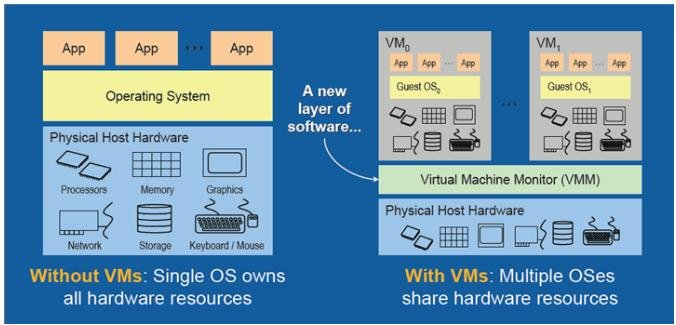
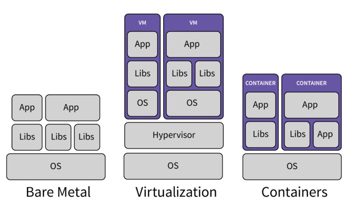

# Introduction

## Virtual Machine & Container

Dengan adaya teknologi virtualisasi machine, kita dapat membagi resource suatu physical machine / dedicated server menjadi beberapa resource machine yang disebut dengan virtual machine (vm). Misal kita memiliki suatu physical machine / dedicated server / bahkan komputer yang kita pakai dengan spesifikasi: RAM 32GB: CPU: 8Core, HDD: 500GB. Dengan spesifikasi tersebut, kita bisa membuat beberapa virtual machine yang berjalan diatas mesin asli tersebut (biasa disebut dengan `host machine`). Misalnya menjadi:

```bash
VM1: Windows 10, RAM 8GB, CPU 2Core, HDD 100GB
VM2: Ubuntu 16, RAM 8GB, CPU 4CORE, HDD 300GB
VM3: Debian 9, RAM 4GB, CPU 2 Core, HDD 100GB
````



Virtual machine tersebut juga dapat dengan mudah & dinamis diubah spesifikasinya sesuai ketersediaan resource pada host machine dan kebutuhan. Selama ini, biasanya `Server` yang kita bayar untuk menginstall aplikasi kita dari provider infrastruktur seperti Amazon, Google Cloud, Digital Ocean sebenarnya adalah dalam bentuk virtual machine. Contohnya layanan [Amazon EC 2 Instance](https://aws.amazon.com/ec2/instance-types/) yang mungkin teman-teman juga pernah menggunakan nya.

Jadi dengan adanya virtual machine:
- Lebih murah dibanding membeli dedicated server / physical machine secara langsung
- Pengelolaan hardware sudah di-abstraksi

Lalu misalnya kita memiliki banyak aplikasi yang harus berjalan di suatu server. Tetapi, masing-masing dari aplikasi tersebut memiliki dependensi yang berbeda-beda. Misalnya:

```bash
app-a: harus berjalan pada sistem operasi linux debian
app-b: harus berjalan pada sistem operasi windows
app-c: harus berjalan pada sistem operasi linux debian pada versi x
app-d: harus berjalan pada sistem operasi linux centos pada versi y
````

Kasus lainnya bisa jadi setiap aplikasi memiliki dependensi sistem operasi yang sama, namun dependensi interpreter aplikasi nya berbeda, misal:

```bash
app-a: harus menggunakan nodejs versi 12
app-b: harus menggunakan nodejs versi 14
app-c: harus menggunakan nodejs versi 10
```

Kasus lainnya lagi, ternyata kebutuhan interpreter dari aplikasi-aplikasi kita tidak berbeda satu sama lain. Contohnya semua aplikasi yang kita miliki sama-sama menggunakan versi nodejs yang sama. Namun karena suatu kepentingan ada hal yang ingin dicapai, misal:

```bash
app-a: tidak boleh ada aplikasi yang bisa mengakses port / disk app-a
app-b: hanya app-a yang boleh mengakses port app-b
app-c: hanya app-b yang boleh mengakses disk app-b
```

Dengan adanya kasus tersebut tentu kita tidak bisa menginstall aplikasi-aplikasi kita di dalam 1 sistem operasi begitu saja baik itu pada 1 dedicated server / 1 virtual machine. Kasus ini biasa dinamakan dengan **Application Isolation**. Bagaimana jika kita ingin melakukan isolasi beberapa aplikasi yang kita miliki dengan vm ? Mudahnya kita bisa melakukan nya dengan membuat model 1 vm 1 aplikasi. Namun dengan model ini, tentunya cost menjadi beberapa kali lipat karena kita perlu membeli / membayar vm tambahan untuk masing-masing aplikasi kita. Lalu kita perlu ada effort untuk melakukan setup / instalasi vm dari awal lagi. Oleh karena itu, muncullah konsep bernama **Container**.



Container digunakan untuk melakukan isolasi aplikasi yang berjalan pada suatu sistem operasi. Dengan adanya container, kita tidak perlu melakukan setup virtual machine seperti instalasi os dari awal. Container lebih murah, dan waktu startup nya lebih cepat dibanding vm. Salah satu teknologi container yang saat ini ramai digunakan adalah **Docker**.
