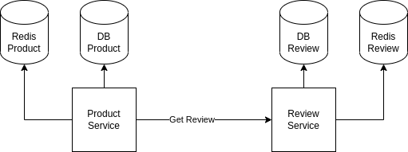
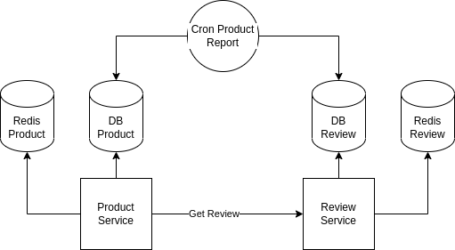

# Day #2: Docker Compose

## Material

1. [Docker Compose](./docker-compose.md)

## Hands On Tasks:

Pada kesempatan ini, kita akan mencoba membuat suatu ekosistem microservices sederhana namun agak kompleks dengan menggunakan `docker-compose`. Yang perlu dilakukan adalah:

- Buatlah 2 api service berdasarkan requirement dibawah ini
- Buat dengan **se-sederhana mungkin**, tujuan dari task ini adalah untuk membangun ekosistem microservice menggunakan `docker-compose` jadi aplikasi tidak perlu terlalu canggih dan `robust` yang penting setiap fungsional dari requirement nya berjalan. Misal, tidak perlu ada validasi suatu field, dll. Bahkan tidak perlu membuat unit test pada task ini
- Direkomendasikan menggunakan `express.js` untuk mengerjakan task ini
- Bisa menggunakan middleware caching berikut pada `express.js` agar kita tidak perlu lagi mengimplementasikan sendiri mekanisme caching dari sisi api https://github.com/kwhitley/apicache
- Buat dockerfile untuk masing-masing service
- Buat 1 file docker-compose untuk membuat eksosistem service menjadi dalam 1 project
- Jika ada informasi yang kurang / butuh ditanyakan silahkan buat issue di https://github.com/imamfzn/jcc-phase3-week2/issues
- Kerjakan sebisanya dan semaksimal mungkin

### Requirements:



Hal yang harus dipenuhi oleh setiap api service:

- Setiap microservice menggunakan metode caching pada setiap pemanggilan endpoint api `GET`
- Teknologi caching yang digunakan adalah `redis`
- Setiap microservice terhubung ke `redis` yang berbeda / tidak sharing
- Setiap microservice terhubung ke database yang berbeda / tidak sharing
- Database dan `redis` antar microservice harus saling terisolasi, misal service product tidak boleh dapat mengakses database / redis service review begitupun sebaliknya untuk service review terhadap database & `redis` product.
- Teknologi database yang digunakan boleh menggunakan `MySQL` / `MongoDB` / `PostgreSQL` silahkan pilih sesuka hati yang menurut kalian paling mudah dan sederhana

Endpoint Product Service:
- `GET /products`, mengambil seluruh data product (hanya data product)
- `POST /products`, membuat data product (hanya data product)
- `GET /products/:id`, mengambil detail product beserta reviewnya
- `PATCH /products/:id`, mengubah data product, tidak termasuk mengubah review

Endpoint Product Review Service:
- `GET /products/:id/reviews`, mengambil seluruh review suatu product
- `POST /products/:id/reviews`, membuat review product

Base Schema:
- Product
    - name: nama product
    - stock: jumlah stock tersedia
    - sold_count: jumlah product terjual
- Review
    - rating: nilai review product dengan skala 1-5
    - text: review dalam bentuk teks

### Challenge



Kalau sudah selesai membuat berdasarkan requirement diatas, buatlah 1 container service yang berperan sebagai cron-job. Fungsi dari cronjob ini adalah untuk mendapatkan product dengan:

- Product dengan jumlah terjual terbanyak (Top Sell)
- Product dengan rata-rata rating terbaik (Top Review)
- Product dengan rata-rata rating terburuk (Bad Product)

Cukup ambil 1 product yang mana saja jika hasil dari ketiga kategori tersebut menghasilkan lebih dari 1 produk. Simpan data hasil olahan container cron ini ke suatu table / collection, yang nantinya akan di konsumsi oleh endpoint `GET /product-reports` pada product service. Kurang lebih output endpoint nya:

```json
{
    "data": {
        "top_sell": {
            "id",
            ...
        },
        "top_review": {
            "id",
            ...
        },
        "bad_product": {
            "id",,
            ...
        }
    }
}
```

Silahkan cari referensi di internet untuk membuat container yang bersifat sebagai cronjob.